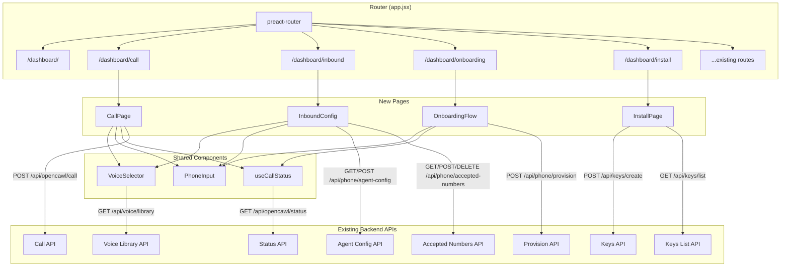
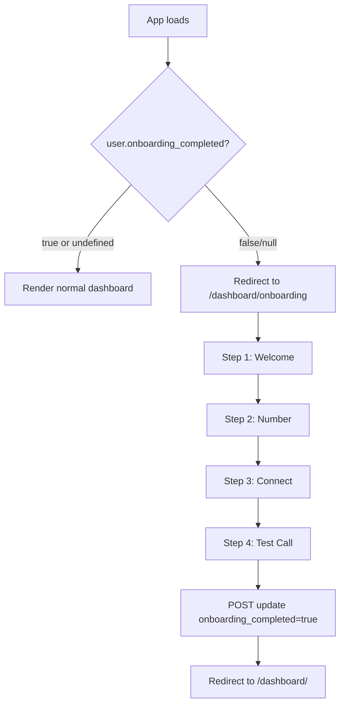
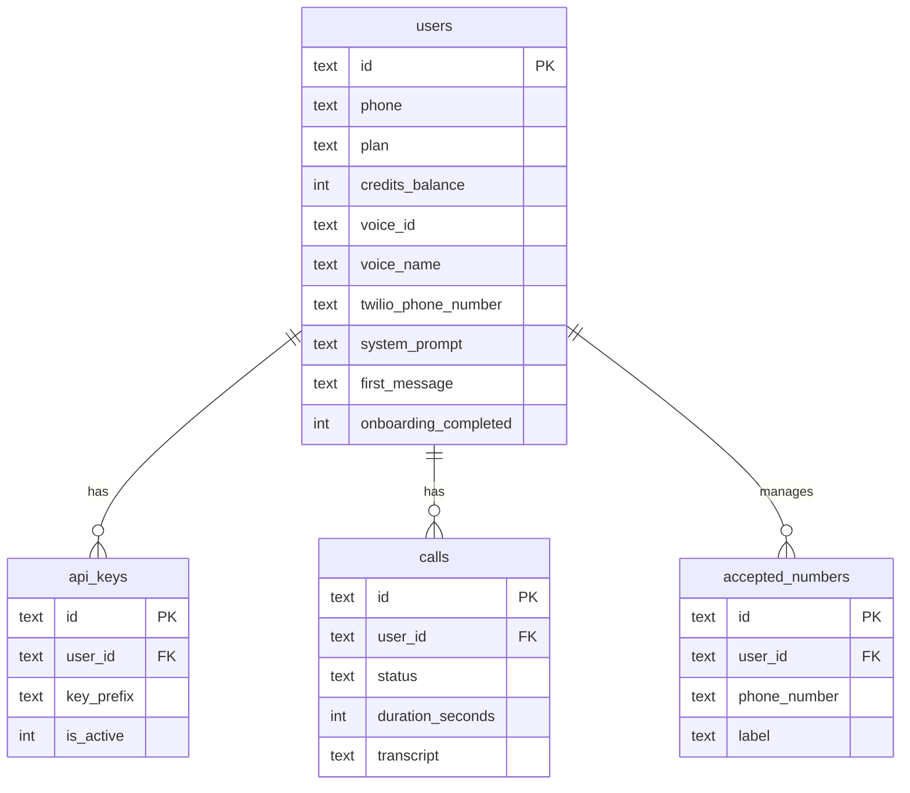

# Design Document: Dashboard Feature Parity

## Overview

This feature adds four missing frontend pages to the dashboard: Make a Call, Inbound Config, Onboarding Flow, and Install/Connect. All backend endpoints already exist — this is primarily a Preact frontend implementation with one small D1 migration (adding `onboarding_completed` to the `users` table) and a minor update to the `/api/auth/me` endpoint.

The implementation follows the existing patterns: Preact functional components with hooks (`useApi`, `useAuth`, `useToast`), `preact-router` for routing, and the coral/dark CSS design system defined in `theme.css`.

Key design decisions:
1. **Reusable VoiceSelector component** — both Call page and Inbound Config need a voice dropdown, so we extract a shared `VoiceSelector` component that fetches from `/api/voice/library`.
2. **Shared useCallStatus hook** — both Call page and Onboarding step 4 need call status polling, so we extract a `useCallStatus(callId)` hook that polls `/api/opencawl/status` every 2 seconds and stops on terminal states.
3. **localStorage for onboarding step** — onboarding progress is stored in `localStorage` keyed by user ID, avoiding a new backend endpoint for step persistence. The `onboarding_completed` flag itself is persisted server-side.
4. **Skill file fetched at runtime** — the Install page and Onboarding step 3 fetch `/opencawl.js` via `fetch()` to display the skill file content, rather than bundling it.

## Architecture



### Onboarding Redirect Flow



## Components and Interfaces

### New Components

#### `src/dashboard/pages/Call.jsx` — CallPage

The Make a Call page with phone input, goal textarea, collapsible advanced options, and live call status display.

**State:**
- `phone` (string) — E.164 destination number from PhoneInput
- `goal` (string) — call goal/message text
- `showAdvanced` (boolean) — whether advanced options are expanded
- `overrideVoiceId` (string) — optional voice override
- `overrideSystemPrompt` (string) — optional system prompt override
- `overrideFirstMessage` (string) — optional first message override
- `calling` (boolean) — POST in-flight flag
- `callId` (string|null) — returned call_id after successful POST

**Behavior:**
- "Call Now" button disabled when `!phone || !goal || calling`
- On submit: POST to `/api/opencawl/call` with `{ destination_phone, message, ...overrides }`
- On success: set `callId`, which triggers `useCallStatus` polling
- Error handling per Requirement 5: parse error code from response, show Toast with appropriate message

#### `src/dashboard/components/VoiceSelector.jsx`

Dropdown that fetches voices from `/api/voice/library` on mount.

**Props:**
- `value` (string) — currently selected voice_id
- `onChange` (function) — callback with selected voice_id
- `id` (string) — form field id

**Behavior:**
- Fetches voice list once on mount, caches in component state
- Renders `<select>` with voice names, empty option for "Default"

#### `src/dashboard/hooks/useCallStatus.js`

Custom hook for polling call status.

**Signature:** `useCallStatus(callId)` → `{ status, transcript, duration, error, reset }`

**Behavior:**
- When `callId` is non-null, starts polling `GET /api/opencawl/status?call_id={callId}` every 2 seconds
- Updates `status`, `transcript`, `duration` from response
- Stops polling when status is `completed` or `failed`
- `reset()` clears all state and stops polling
- Cleans up interval on unmount

#### `src/dashboard/pages/InboundConfig.jsx`

Agent configuration form + accepted numbers management.

**Sections:**
1. Agent Config form: system_prompt textarea, first_message input, VoiceSelector, Save button
2. Accepted Numbers (paid users only): list with remove buttons, add form with PhoneInput + label input

**Behavior:**
- On mount: fetch agent config from `GET /api/phone/agent-config`, populate form
- On mount (paid users): fetch accepted numbers from `GET /api/phone/accepted-numbers`
- Save: POST to `/api/phone/agent-config`
- Add number: POST to `/api/phone/accepted-numbers` with `{ numbers: [{ phone_number, label }] }`
- Remove number: DELETE to `/api/phone/accepted-numbers` with `{ phone_numbers: [number] }`
- Free users see a message instead of the accepted numbers section

#### `src/dashboard/pages/Onboarding.jsx`

Multi-step onboarding wizard with 4 steps.

**State:**
- `step` (number 1-4) — current step, initialized from localStorage
- `provisionedNumber` (string|null) — number from step 2
- `apiKey` (string|null) — generated key from step 3

**Step behavior:**
1. Welcome: show user phone, "Get Started" button
2. Number: "Provision Number" button → POST `/api/phone/provision`, "Skip" link
3. Connect: auto-generate API key if none exists, show key + skill file content, "Copy" buttons
4. Test Call: reuse call form + useCallStatus, "Finish Setup" / "Skip" both mark onboarding complete

**Progress persistence:** `localStorage.setItem(`onboarding_step_${user.id}`, step)`

**Completion:** POST to a new lightweight endpoint or PATCH to update `onboarding_completed = true`. Since we want to keep this minimal, we'll reuse `POST /api/phone/agent-config` pattern — but actually, the simplest approach is to add a `POST /api/auth/onboarding-complete` endpoint that just sets the flag. This is a single SQL UPDATE.

#### `src/dashboard/pages/Install.jsx`

API key generation + skill file display page.

**Behavior:**
- On mount: fetch existing keys from `GET /api/keys/list`
- "Generate Setup Key" button: POST to `/api/keys/create`, display full key with copy button and warning
- Fetch and display `/opencawl.js` content in a `<pre>` code block with copy button

### Modified Components

#### `src/dashboard/app.jsx`

- Import and register routes for Call, InboundConfig, Onboarding, Install
- Add onboarding redirect: if `user.onboarding_completed === false || user.onboarding_completed === null`, redirect to `/dashboard/onboarding` (except when already on that route)

#### `src/dashboard/components/Layout.jsx`

- Add nav items to `NAV_ITEMS` array:
  - `{ path: '/dashboard/call', label: 'Make a Call', Icon: PhoneOutIcon }`
  - `{ path: '/dashboard/inbound', label: 'Inbound', Icon: PhoneIncomingIcon }`
  - `{ path: '/dashboard/install', label: 'Install', Icon: DownloadIcon }`
- Onboarding page renders without the Layout sidebar (full-screen wizard)

#### `src/dashboard/components/Icons.jsx`

- Add new icons: `PhoneOutIcon`, `PhoneIncomingIcon`, `DownloadIcon`, `CopyIcon`, `ChevronDownIcon`, `ChevronUpIcon`

### New Backend Endpoint

#### `POST /api/auth/onboarding-complete`

Minimal endpoint to mark onboarding as done.

```javascript
// functions/api/auth/onboarding-complete.js
export async function onRequestPost(context) {
  const user = context.data.user;
  await context.env.DB
    .prepare('UPDATE users SET onboarding_completed = 1 WHERE id = ?')
    .bind(user.id)
    .run();
  return new Response(JSON.stringify({ success: true }), {
    status: 200,
    headers: { 'Content-Type': 'application/json' },
  });
}
```

#### `GET /api/auth/me` (Modified)

Add `onboarding_completed` to the profile response:

```javascript
const profile = {
  // ...existing fields
  onboarding_completed: user.onboarding_completed === 1,
};
```

## Data Models

### Migration: Add onboarding_completed to users

```sql
-- migrations/0012_add_onboarding_completed.sql
ALTER TABLE users ADD COLUMN onboarding_completed INTEGER NOT NULL DEFAULT 0;
```

This is the only schema change. All other data (call records, agent config, accepted numbers, API keys) already exists.

### Entity Relationships (relevant subset)


