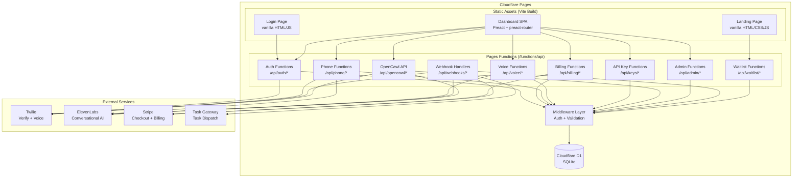
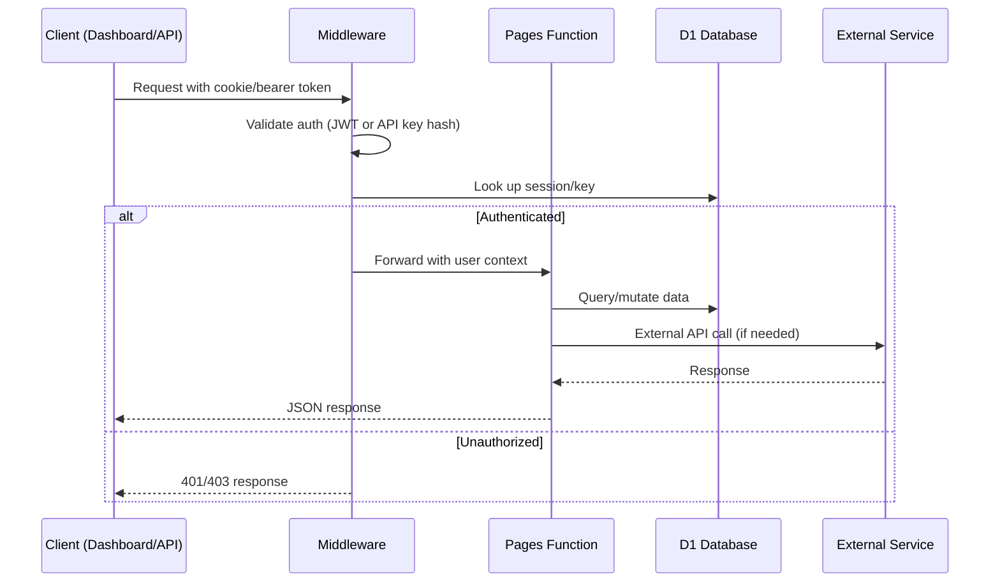
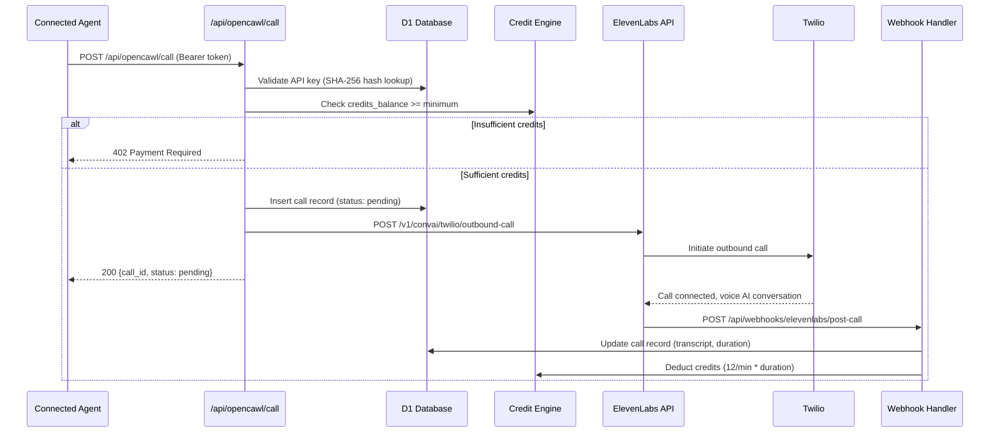
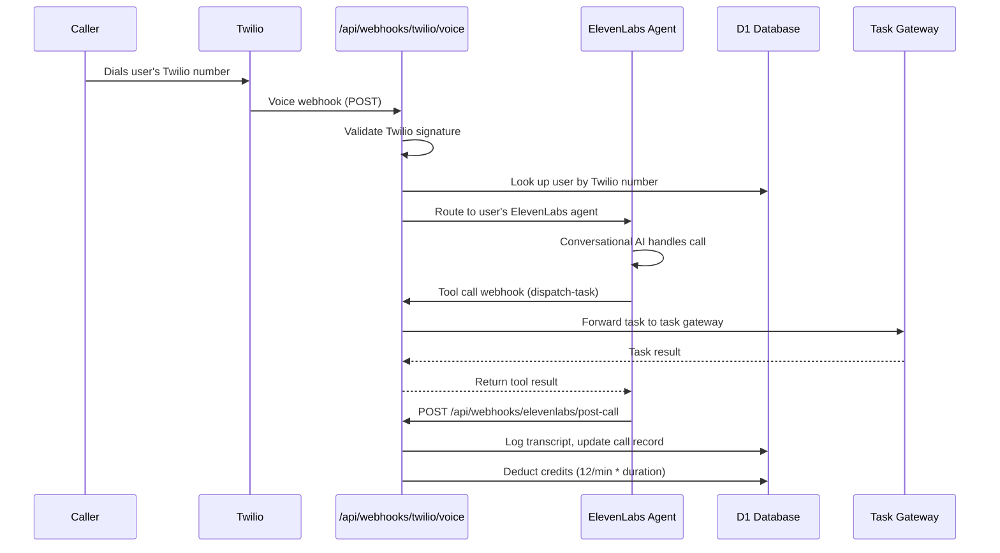
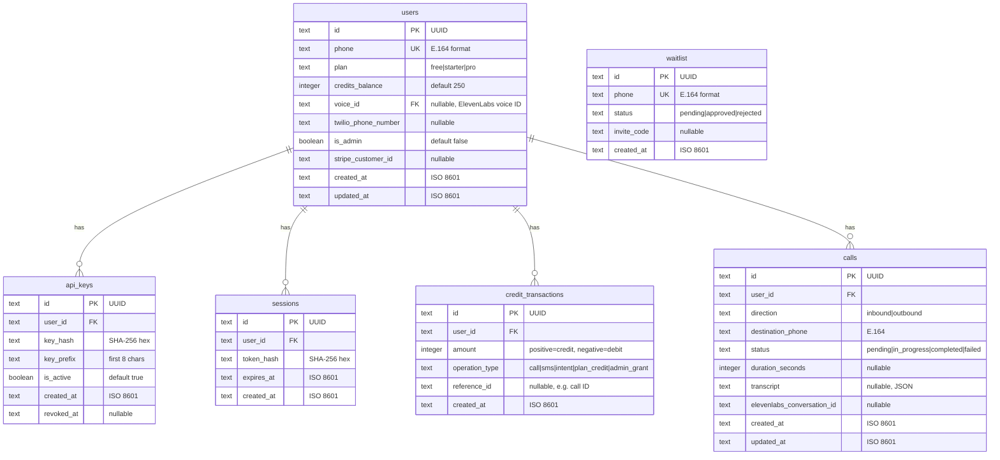

# Design Document: OpenCawl Phone Platform

## Overview

The OpenCawl Phone Platform is a full-stack application that gives connected AI agents phone calling capabilities. It runs entirely on Cloudflare Pages (Functions + static assets) with zero backend dependencies, using only Web APIs for all cryptographic and HTTP operations.

The system integrates three external services — Twilio (SMS OTP + Programmable Voice), ElevenLabs (Conversational AI agents), and Stripe (subscription billing) — all accessed via raw `fetch()` calls. User data lives in Cloudflare D1 (SQLite). The frontend is a Preact SPA for the dashboard and vanilla HTML for the landing page, both built with Vite.

### Key Design Decisions

1. **Zero-dependency backend**: All backend code uses Web APIs (`crypto.subtle`, `fetch`, `Response`, `Request`). No npm packages for auth, payments, or telephony. This keeps the Cloudflare Pages Functions bundle small and avoids Node.js runtime assumptions.

2. **ElevenLabs native Twilio integration**: Rather than building custom WebSocket bridges, the platform uses ElevenLabs' native Twilio integration. Phone numbers are imported into ElevenLabs, which handles the voice AI ↔ telephony bridge. The platform orchestrates via the ElevenLabs Conversational AI API (`/v1/convai/twilio/outbound-call` for outbound, agent assignment for inbound).

3. **Append-only credit ledger**: Credits are tracked via an append-only `credit_transactions` table. The `users.credits_balance` column is the materialized balance, updated atomically alongside each ledger insert within a single D1 transaction. This provides auditability and a consistency invariant.

4. **JWT via crypto.subtle**: Session tokens are HMAC-SHA256 JWTs signed and verified using the Web Crypto API. No `jsonwebtoken` library needed.

5. **Stripe without SDK**: All Stripe interactions use raw `fetch()` against `https://api.stripe.com/v1/*` with form-encoded bodies and `Authorization: Bearer sk_*` headers. Webhook signatures are verified using `crypto.subtle` HMAC-SHA256.

## Architecture

### High-Level Architecture



### Request Flow



### Outbound Call Flow



### Inbound Call Flow



## Components and Interfaces

### 1. Middleware Layer (`functions/_middleware.js`)

The middleware intercepts all `/api/*` requests and handles authentication routing:

- **Public routes** (no auth): `/api/auth/send-code`, `/api/auth/verify-code`, `/api/waitlist/join`, `/api/webhooks/*`
- **Session auth routes** (JWT cookie): `/api/auth/me`, `/api/auth/logout`, `/api/billing/*`, `/api/phone/*`, `/api/voice/*`, `/api/keys/*`, `/api/admin/*`
- **API key auth routes** (Bearer token): `/api/opencawl/*`

```typescript
// Middleware signature
export async function onRequest(context: EventContext): Promise<Response>

// Context enrichment - attaches user to context.data
interface AuthenticatedContext {
  data: {
    user: {
      id: string;
      phone: string;
      plan: 'free' | 'starter' | 'pro';
      credits_balance: number;
      voice_id: string | null;
      is_admin: boolean;
    };
  };
}
```

### 2. Auth Service (`functions/api/auth/`)

| Endpoint | Method | Auth | Description |
|---|---|---|---|
| `/api/auth/send-code` | POST | None | Send OTP via Twilio Verify |
| `/api/auth/verify-code` | POST | None | Verify OTP, create/retrieve user, issue JWT |
| `/api/auth/me` | GET | Session | Return current user profile |
| `/api/auth/logout` | POST | Session | Invalidate session, clear cookie |

**JWT Structure:**
```json
{
  "sub": "<user_id>",
  "iat": 1700000000,
  "exp": 1700086400
}
```

JWT signing uses `crypto.subtle.importKey` with HMAC-SHA256 and `crypto.subtle.sign`/`verify`. Tokens are base64url-encoded header.payload.signature.

### 3. API Key Service (`functions/api/keys/`)

| Endpoint | Method | Auth | Description |
|---|---|---|---|
| `/api/keys/create` | POST | Session | Generate new API key, return plaintext once |
| `/api/keys/list` | GET | Session | List keys (prefix + metadata only) |
| `/api/keys/revoke` | POST | Session | Revoke a key by ID |

Key generation: `crypto.getRandomValues(new Uint8Array(32))` → hex string. Storage: SHA-256 hash of the full key. The prefix (first 8 chars) is stored for display.

### 4. Credit Engine (`functions/lib/credits.js`)

```typescript
interface CreditEngine {
  // Atomically deduct credits and log transaction
  deduct(db: D1Database, userId: string, amount: number, operationType: string, referenceId: string): Promise<void>;
  
  // Check if user has sufficient credits
  check(db: D1Database, userId: string, requiredAmount: number): Promise<boolean>;
  
  // Add credits (plan upgrade, admin grant)
  add(db: D1Database, userId: string, amount: number, operationType: string, referenceId: string): Promise<void>;
  
  // Get transaction history
  getTransactions(db: D1Database, userId: string, limit?: number, offset?: number): Promise<CreditTransaction[]>;
}
```

All deduct/add operations run inside a D1 batch (transaction): UPDATE users SET credits_balance + INSERT INTO credit_transactions. This ensures atomicity.

**Credit Rates:**
- Voice call: 12 credits/minute
- SMS: 2 credits/message
- Intent classification: 1 credit/operation

### 5. Billing Service (`functions/api/billing/`)

| Endpoint | Method | Auth | Description |
|---|---|---|---|
| `/api/billing/checkout` | POST | Session | Create Stripe Checkout session |
| `/api/billing/portal` | POST | Session | Create Stripe Customer Portal session |
| `/api/billing/usage` | GET | Session | Get credit usage history |

All Stripe API calls use `fetch('https://api.stripe.com/v1/...', { headers: { Authorization: 'Bearer sk_...' }, body: new URLSearchParams({...}) })`.

**Stripe Plans:**
| Plan | Price ID | Monthly Cost | Credits |
|---|---|---|---|
| Starter | `price_starter_monthly` | $20 | 1,200 |
| Pro | `price_pro_monthly` | $50 | 4,200 |

### 6. Phone Service (`functions/api/phone/`)

| Endpoint | Method | Auth | Description |
|---|---|---|---|
| `/api/phone/provision` | POST | Session | Provision dedicated Twilio number (paid plans) |
| `/api/phone/configure` | POST | Session | Update webhook/voicemail config |

For free-tier users, the system assigns a number from a shared pool stored in a `shared_phone_numbers` table. Paid users get a dedicated number provisioned via the Twilio REST API and imported into ElevenLabs.

### 7. Voice Service (`functions/api/voice/`)

| Endpoint | Method | Auth | Description |
|---|---|---|---|
| `/api/voice/library` | GET | Session | List 20 curated voices |
| `/api/voice/preview` | GET | Session | Get voice preview audio URL |
| `/api/voice/select` | POST | Session | Set user's voice_id |
| `/api/voice/clone` | POST | Session | Clone custom voice (Pro only) |

Voice data is fetched from the ElevenLabs API (`/v1/voices`) and filtered to a curated set. The curated voice list is stored as a configuration constant.

### 8. OpenCawl API (`functions/api/opencawl/`)

| Endpoint | Method | Auth | Description |
|---|---|---|---|
| `/api/opencawl/call` | POST | API Key | Initiate outbound call |
| `/api/opencawl/status` | GET | API Key | Get call status/transcript |
| `/api/opencawl/credits` | GET | API Key | Get credit balance |

### 9. Webhook Handlers (`functions/api/webhooks/`)

| Endpoint | Source | Verification |
|---|---|---|
| `/api/webhooks/stripe` | Stripe | HMAC-SHA256 signature via `crypto.subtle` |
| `/api/webhooks/twilio/voice` | Twilio | Request signature validation |
| `/api/webhooks/elevenlabs/post-call` | ElevenLabs | API key / shared secret |
| `/api/webhooks/elevenlabs/tools` | ElevenLabs | API key / shared secret |

### 10. Admin Panel (`functions/api/admin/`)

| Endpoint | Method | Auth | Description |
|---|---|---|---|
| `/api/admin/stats` | GET | Session + Admin | Platform statistics |
| `/api/admin/users` | GET | Session + Admin | List all users |
| `/api/admin/waitlist` | GET | Session + Admin | List waitlist entries |
| `/api/admin/waitlist/approve` | POST | Session + Admin | Approve waitlist entry |
| `/api/admin/waitlist/reject` | POST | Session + Admin | Reject waitlist entry |

Admin endpoints check `context.data.user.is_admin === true` before processing.

### 11. Dashboard SPA (`src/dashboard/`)

```
src/dashboard/
├── index.html          # Entry point
├── app.jsx             # Root component with preact-router
├── pages/
│   ├── Home.jsx        # Call log + credit balance + quick actions
│   ├── Voice.jsx       # Voice grid with preview + select
│   ├── Keys.jsx        # API key management
│   ├── Phone.jsx       # Phone number config
│   ├── Billing.jsx     # Plan cards + usage chart
│   ├── Settings.jsx    # Account details + logout
│   └── Admin.jsx       # Admin panel (conditional)
├── components/
│   ├── Layout.jsx      # Shell with nav sidebar
│   ├── Toast.jsx       # Toast notification system
│   ├── Modal.jsx       # Confirmation modal for destructive actions
│   ├── CreditCard.jsx  # Credit balance display
│   └── CallLog.jsx     # Call history table
├── hooks/
│   ├── useAuth.js      # Auth state + /api/auth/me
│   ├── useApi.js       # Fetch wrapper with error handling
│   └── useTheme.js     # Dark/light theme toggle
└── styles/
    └── theme.css       # CSS custom properties for theming
```

### 12. Landing Page (`src/landing/`)

```
src/landing/
├── index.html          # Vanilla HTML with hero, features, pricing, waitlist form
├── styles.css          # Standalone CSS
└── script.js           # Waitlist form submission + validation
```

### 13. OpenCawl Skill File (`public/opencawl.js`)

```javascript
// Exported functions
export async function make_call(to, message) { /* POST /api/opencawl/call */ }
export async function check_call_status(call_id) { /* GET /api/opencawl/status */ }
export async function get_credits() { /* GET /api/opencawl/credits */ }
```

## Data Models

### Database Schema (Cloudflare D1 / SQLite)



### Migration Files

Migrations are managed via `wrangler d1 migrations apply` and stored in `migrations/`:

```
migrations/
├── 0001_create_users.sql
├── 0002_create_api_keys.sql
├── 0003_create_sessions.sql
├── 0004_create_credit_transactions.sql
├── 0005_create_calls.sql
└── 0006_create_waitlist.sql
```

### Vite Build Configuration

Multi-page build with three entry points:

```javascript
// vite.config.js
export default {
  build: {
    rollupOptions: {
      input: {
        landing: 'src/landing/index.html',
        login: 'src/login/index.html',
        dashboard: 'src/dashboard/index.html',
      }
    }
  }
}
```

### Environment Variables

```
# .dev.vars (local) / Cloudflare Pages env vars (production)
TWILIO_ACCOUNT_SID=AC...
TWILIO_AUTH_TOKEN=...
TWILIO_VERIFY_SERVICE_SID=VA...
ELEVENLABS_API_KEY=xi-...
ELEVENLABS_AGENT_ID=...
STRIPE_SECRET_KEY=sk_...
STRIPE_WEBHOOK_SECRET=whsec_...
JWT_SECRET=...
ADMIN_PHONE_NUMBERS=+1...,+1...
```


## Correctness Properties

*A property is a characteristic or behavior that should hold true across all valid executions of a system — essentially, a formal statement about what the system should do. Properties serve as the bridge between human-readable specifications and machine-verifiable correctness guarantees.*

### Property 1: Phone number validation rejects non-E.164 strings

*For any* string that does not match the E.164 phone number format (e.g., missing `+` prefix, contains letters, wrong digit count), submitting it to `/api/auth/send-code` SHALL return a 400 status code. Conversely, *for any* string that matches E.164 format (`+` followed by 1-15 digits), the validation step SHALL pass.

**Validates: Requirements 1.4**

### Property 2: JWT sign/verify round-trip with expiration enforcement

*For any* valid user ID and future expiration timestamp, signing a JWT payload with HMAC-SHA256 via `crypto.subtle` and then verifying the resulting token SHALL return the original payload unchanged. Conversely, *for any* JWT with an expiration timestamp in the past, verification SHALL fail regardless of signature validity.

**Validates: Requirements 1.7, 3.4**

### Property 3: API key hash round-trip

*For any* cryptographically generated API key token, computing its SHA-256 hash and storing it, then later hashing the same plaintext token and looking up the result SHALL find the stored record. *For any* token not previously generated, the hash lookup SHALL return no match.

**Validates: Requirements 4.1, 4.4, 4.5**

### Property 4: Revoked API key authentication rejection

*For any* API key that has been marked as revoked, authenticating a request bearing that key's plaintext token SHALL fail with a 401 status, even though the hash lookup finds a matching record.

**Validates: Requirements 4.3**

### Property 5: Credit rate calculation correctness

*For any* credit-consuming operation with a given type and quantity (call duration in minutes, SMS count, or intent count), the Credit_Engine SHALL compute the deduction as exactly: `12 * ceil(minutes)` for calls, `2 * count` for SMS, and `1 * count` for intents.

**Validates: Requirements 5.1**

### Property 6: Credit ledger consistency invariant

*For any* user and *for any* sequence of credit operations (deductions and additions), the user's `credits_balance` SHALL equal their initial credit allocation plus the sum of all `credit_transactions.amount` values. This invariant SHALL hold after every individual operation.

**Validates: Requirements 5.2, 5.7**

### Property 7: Insufficient credits rejection

*For any* user whose `credits_balance` is less than the cost of a requested operation, the Credit_Engine SHALL reject the operation with a 402 status code, and both the `credits_balance` and the `credit_transactions` table SHALL remain unchanged.

**Validates: Requirements 5.3**

### Property 8: Daily usage aggregation correctness

*For any* set of credit transactions with various timestamps within a billing period, grouping them by calendar day SHALL produce daily totals whose sum equals the total of all individual transaction amounts. No transaction SHALL appear in more than one day's group, and no transaction SHALL be omitted.

**Validates: Requirements 6.6**

### Property 9: Webhook signature verification

*For any* webhook payload and its correctly computed HMAC signature (using the appropriate secret for Stripe or Twilio), signature verification SHALL pass. *For any* payload where either the payload bytes or the signature have been altered, verification SHALL fail.

**Validates: Requirements 15.1, 15.2, 15.5**

### Property 10: Input sanitization against injection

*For any* user-supplied string containing SQL injection patterns (e.g., `'; DROP TABLE`, `OR 1=1`) or XSS patterns (e.g., `<script>`, `javascript:`), the input validation layer SHALL either reject the input or neutralize the dangerous content before it reaches the database or is rendered in responses.

**Validates: Requirements 18.5**

## Error Handling

### HTTP Error Response Format

All API errors return a consistent JSON structure:

```json
{
  "error": {
    "code": "INSUFFICIENT_CREDITS",
    "message": "Your credit balance (15) is insufficient for this operation (cost: 24)"
  }
}
```

### Error Categories

| HTTP Status | Code | When |
|---|---|---|
| 400 | `INVALID_INPUT` | Malformed phone number, missing required fields, invalid JSON |
| 401 | `UNAUTHORIZED` | Invalid/expired JWT, invalid/revoked API key, failed webhook signature |
| 402 | `INSUFFICIENT_CREDITS` | Credit balance too low for requested operation |
| 403 | `FORBIDDEN` | Non-admin accessing admin endpoints, non-Pro user attempting voice clone |
| 404 | `NOT_FOUND` | Call ID, voice ID, or key ID not found |
| 409 | `CONFLICT` | Phone number already on waitlist, duplicate provisioning request |
| 429 | `RATE_LIMITED` | Too many OTP requests (Twilio rate limit passthrough) |
| 500 | `INTERNAL_ERROR` | Unexpected errors, external service failures |

### External Service Error Handling

- **Twilio errors**: Catch fetch failures and Twilio error codes. Map to appropriate HTTP status. Never expose Twilio error details to end users.
- **ElevenLabs errors**: Catch API errors during voice operations and call initiation. Log full error, return generic message to user.
- **Stripe errors**: Catch fetch failures and Stripe error responses. For webhook processing, return 200 to Stripe even on internal errors (to prevent retry storms) but log the failure for manual resolution.
- **D1 errors**: Catch constraint violations (unique phone, duplicate keys). Map `SQLITE_CONSTRAINT` to 409 Conflict. Wrap all multi-statement operations in D1 batch for atomicity.

### Credit Engine Error Recovery

If a credit deduction fails mid-transaction (e.g., D1 batch fails), the entire batch is rolled back — no partial state. The call record remains in `pending` status and can be retried or cleaned up by a periodic check.

### Webhook Idempotency

Webhook handlers check for duplicate processing by looking up the external event ID (Stripe event ID, ElevenLabs conversation ID) before processing. If already processed, return 200 without re-processing.

## Testing Strategy

### Unit Tests

Unit tests cover individual functions and modules with mocked dependencies:

- **JWT utilities**: Sign, verify, decode, expiration check
- **API key utilities**: Generate, hash, prefix extraction
- **Credit Engine**: Rate calculation, balance check, transaction creation
- **Phone validation**: E.164 format validation
- **Input sanitization**: SQL injection and XSS pattern detection
- **Webhook signature verification**: HMAC computation and comparison
- **Usage aggregation**: Daily grouping logic

Framework: Vitest (compatible with Vite build pipeline)

### Property-Based Tests

Property-based tests validate the 10 correctness properties defined above using [fast-check](https://github.com/dubzzz/fast-check) with Vitest.

**Configuration:**
- Minimum 100 iterations per property test
- Each test tagged with: `Feature: opencawl-phone-platform, Property {N}: {title}`

**Property test targets:**
- `lib/jwt.js` — Properties 1, 2
- `lib/api-keys.js` — Properties 3, 4
- `lib/credits.js` — Properties 5, 6, 7
- `lib/usage.js` — Property 8
- `lib/webhooks.js` — Property 9
- `lib/validation.js` — Properties 1, 10

### Integration Tests

Integration tests verify end-to-end flows with mocked external services:

- **Auth flow**: Send code → verify code → get profile → logout
- **API key flow**: Create key → list keys → use key for API auth → revoke → verify rejection
- **Credit flow**: Check balance → perform operation → verify deduction → verify transaction logged
- **Billing flow**: Create checkout → process webhook → verify plan upgrade + credit addition
- **Call flow**: Initiate call → process post-call webhook → verify transcript + credit charge
- **Webhook flow**: Receive webhook → verify signature → process event → verify side effects

External services (Twilio, ElevenLabs, Stripe) are mocked using Vitest's `vi.fn()` to intercept `fetch` calls.

### Smoke Tests

- Vite build completes without errors for all three entry points
- Database migrations apply cleanly to a fresh D1 instance
- No Node.js-specific imports in any Pages Function file
- All environment variables referenced in code are documented
