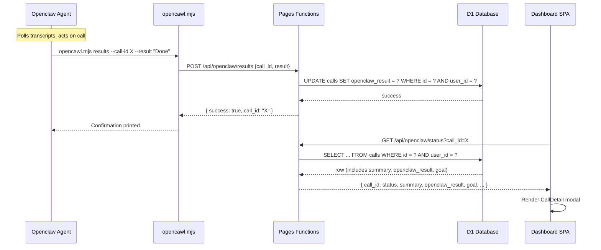

# Design Document: OpenClaw Results Callback

## Overview

This feature adds a closed-loop results pipeline between the Openclaw agent and the OpenCawl platform. Today the agent polls for transcripts and acts on them, but outcomes vanish into the void. This design introduces:

1. A new `openclaw_result` column on the `calls` table (D1 migration)
2. A `POST /api/openclaw/results` endpoint for the agent to submit outcomes
3. Enriched `GET /api/openclaw/status` response with `summary`, `openclaw_result`, and `goal`
4. Updated SKILL.md and CLI script with a `results` command
5. A `CallDetail` modal component in the dashboard for viewing full call details

The design follows existing patterns: Cloudflare Pages Functions for API routes, D1 for storage, `parseBody` from `functions/lib/validation.js` for input parsing, Bearer token auth via the existing middleware, and Preact components for the dashboard.

## Architecture



The new endpoint slots into the existing `/api/openclaw/` route family. Middleware already handles Bearer token auth for all `/api/openclaw/*` paths, so no auth changes are needed. The CLI gains a `results` command that mirrors the existing `call`, `status`, `transcripts`, and `credits` commands.

## Components and Interfaces

### 1. DB Migration (`migrations/0016_add_openclaw_result.sql`)

Adds a single nullable TEXT column to the `calls` table. SQLite TEXT columns have no inherent length limit; the 10,000-character cap is enforced at the API layer.

### 2. POST /api/openclaw/results (`functions/api/openclaw/results.js`)

New Pages Function exporting `onRequestPost`. Follows the same patterns as `call.js` and `status.js`:

```
Input:  { call_id: string, result: string }
Output: { success: true, call_id: string }  (200)
        { error: { code, message } }        (400 | 404 | 500)
```

Validation:
- Uses `parseBody(request, ['call_id', 'result'])` from `functions/lib/validation.js`
- Rejects `result` exceeding 10,000 characters
- Verifies the call belongs to the authenticated user via `WHERE id = ? AND user_id = ?`
- Returns 404 if no matching row (covers both non-existent and wrong-user cases)

SQL:
```sql
UPDATE calls SET openclaw_result = ?, updated_at = ? WHERE id = ? AND user_id = ?
```

### 3. GET /api/openclaw/status (updated) (`functions/api/openclaw/status.js`)

The existing endpoint uses `SELECT * FROM calls`, so the new `openclaw_result` column is already fetched. Changes are response-only — add three fields to the JSON output:

- `summary`: `row.summary ?? null`
- `openclaw_result`: `row.openclaw_result ?? null`
- `goal`: `row.goal ?? null`

### 4. SKILL.md Updates (`public/opencawl/SKILL.md`)

- Add `results` to the Core Behavior action sequence as step 3
- Add a new "Task: Post results back" section with CLI usage example
- Update the command reference in the default/help output

### 5. CLI Script Updates (`public/opencawl/scripts/opencawl.mjs`)

Add a `results` case to the switch statement:

```
opencawl.mjs results --call-id <UUID> --result "Outcome description"
```

Sends `POST /api/openclaw/results` with `{ call_id, result }`. Prints confirmation on success, error + exit(1) on failure. Validates that both `--call-id` and `--result` are provided before making the request.

### 6. CallDetail Component (`src/dashboard/components/CallDetail.jsx`)

A modal overlay component rendered when a user clicks a call row in `CallLog`. It fetches full call data from `GET /api/openclaw/status?call_id=<id>` and displays:

- Call metadata: direction, phone, status badge, duration, date
- Summary section
- Transcript section (formatted with speaker labels)
- Openclaw Result section
- Close button (X) and backdrop click to dismiss

### 7. CallLog Updates (`src/dashboard/components/CallLog.jsx`)

- Add `onClick` handler to each `<tr>` with `cursor: pointer` styling
- Accept an `onCallClick(callId)` callback prop
- Parent components (`Home.jsx`) manage the selected call state and render `CallDetail`


## Data Models

### Calls Table (after migration 0016)

Current schema (accumulated from migrations 0005, 0010, 0013, 0015):

| Column | Type | Notes |
|--------|------|-------|
| id | TEXT PK | UUID |
| user_id | TEXT NOT NULL | FK → users |
| direction | TEXT NOT NULL | 'inbound' or 'outbound' |
| destination_phone | TEXT | E.164 |
| status | TEXT NOT NULL | 'pending', 'in_progress', 'completed', 'failed' |
| duration_seconds | INTEGER | Set by post-call webhook |
| transcript | TEXT | JSON array of {role, message} |
| elevenlabs_conversation_id | TEXT | |
| override_system_prompt | TEXT | Per-call agent override |
| override_voice_id | TEXT | Per-call agent override |
| override_first_message | TEXT | Per-call agent override |
| goal | TEXT | Natural language task description |
| source | TEXT NOT NULL DEFAULT 'api' | Call origin |
| summary | TEXT | Generated from transcript |
| **openclaw_result** | **TEXT** | **NEW — agent outcome text, max 10k chars enforced at API** |
| created_at | TEXT NOT NULL | ISO 8601 |
| updated_at | TEXT NOT NULL | ISO 8601 |

### Migration SQL (`migrations/0016_add_openclaw_result.sql`)

```sql
-- Add openclaw_result column for storing agent action outcomes.
ALTER TABLE calls ADD COLUMN openclaw_result TEXT;
```

### Results Endpoint Request/Response

**Request:**
```json
{
  "call_id": "uuid-string",
  "result": "Rescheduled the dentist appointment to next Thursday at 2pm."
}
```

**Success Response (200):**
```json
{
  "success": true,
  "call_id": "uuid-string"
}
```

**Error Responses:**
- 400: `{ "error": { "code": "INVALID_INPUT", "message": "..." } }`
- 404: `{ "error": { "code": "NOT_FOUND", "message": "Call not found" } }`
- 500: `{ "error": { "code": "INTERNAL_ERROR", "message": "..." } }`

### Updated Status Endpoint Response

```json
{
  "call_id": "uuid-string",
  "status": "completed",
  "duration_seconds": 120,
  "transcript": "[{\"role\":\"agent\",\"message\":\"Hello\"}]",
  "summary": "Goal: Reschedule appointment | Outcome: Confirmed Thursday 2pm",
  "openclaw_result": "Rescheduled to Thursday 2pm. Calendar updated.",
  "goal": "Reschedule my dentist appointment",
  "agent_override": null
}
```


## Correctness Properties

*A property is a characteristic or behavior that should hold true across all valid executions of a system — essentially, a formal statement about what the system should do. Properties serve as the bridge between human-readable specifications and machine-verifiable correctness guarantees.*

### Property 1: Results round-trip — stored result matches submitted result

*For any* valid result string (1 to 10,000 characters) and any existing call owned by the authenticated user, POSTing that result to `/api/openclaw/results` and then GETting `/api/openclaw/status?call_id=<id>` SHALL return the exact same result string in the `openclaw_result` field, and the POST response SHALL be HTTP 200 with `{ success: true, call_id: "<id>" }`.

**Validates: Requirements 2.3, 2.4**

### Property 2: Invalid payloads are rejected

*For any* JSON payload where `call_id` is missing/empty OR `result` is missing/empty, the Results_Endpoint SHALL return HTTP 400 with error code `INVALID_INPUT`. The call record (if it exists) SHALL remain unchanged.

**Validates: Requirements 2.2, 2.6**

### Property 3: Result length enforcement

*For any* string of length > 10,000 characters submitted as the `result` field, the Results_Endpoint SHALL return HTTP 400 with error code `INVALID_INPUT`. *For any* string of length between 1 and 10,000 characters (inclusive), the endpoint SHALL accept it (given a valid call_id owned by the user).

**Validates: Requirements 1.3, 2.8**

### Property 4: Status endpoint returns all stored call fields

*For any* call record with arbitrary values for `summary`, `openclaw_result`, and `goal` (including NULL), the `GET /api/openclaw/status` response SHALL include those exact values in the corresponding `summary`, `openclaw_result`, and `goal` fields.

**Validates: Requirements 6.1, 6.2, 6.3**

### Property 5: Transcript formatting preserves all speaker labels and messages

*For any* transcript array of `{role, message}` objects, the formatted transcript text SHALL contain each message's text and a speaker label derived from the role for every entry in the array.

**Validates: Requirements 5.3**

### Property 6: CallDetail renders all call data fields or placeholders

*For any* call data object, the CallDetail component SHALL render the summary text (or a placeholder when null), the openclaw_result text (or a placeholder when null), and all metadata fields (direction, phone, status, duration, date).

**Validates: Requirements 5.2, 5.4, 5.5**

## Error Handling

### Results Endpoint Errors

| Scenario | HTTP Status | Error Code | Message |
|----------|-------------|------------|---------|
| Missing/empty `call_id` or `result` | 400 | INVALID_INPUT | "Missing required fields: ..." |
| `result` exceeds 10,000 chars | 400 | INVALID_INPUT | "result must not exceed 10,000 characters" |
| Invalid JSON body | 400 | INVALID_INPUT | "Invalid JSON in request body" |
| Call not found or wrong user | 404 | NOT_FOUND | "Call not found" |
| DB update fails | 500 | INTERNAL_ERROR | "Failed to update call result" |
| No auth token | 401 | UNAUTHORIZED | Handled by existing middleware |

### Status Endpoint (unchanged error behavior)

Existing error handling remains. The new fields (`summary`, `openclaw_result`, `goal`) are nullable and returned as `null` when not set — no new error paths.

### CLI Error Handling

- Missing `--call-id` or `--result`: prints usage error, exits with code 1
- API error response: prints the error message from the response, exits with code 1
- Network failure: prints error, exits with code 1

### Dashboard Error Handling

- `CallDetail` shows a loading spinner while fetching from `/api/openclaw/status`
- On fetch failure, displays an error message within the modal
- Gracefully handles null/missing fields with placeholder text ("No summary available", "No result posted yet", etc.)

## Testing Strategy

### Property-Based Tests (fast-check, minimum 100 iterations each)

The project already uses `fast-check` (v3.15.0) with `vitest`. Property tests will be added to `functions/api/openclaw/openclaw.test.js` following the existing pattern.

| Property | Test Location | What Varies |
|----------|--------------|-------------|
| Property 1: Results round-trip | `openclaw.test.js` | Random result strings (1–10k chars), various call states |
| Property 2: Invalid payloads | `openclaw.test.js` | Random combinations of missing/empty/null call_id and result |
| Property 3: Length enforcement | `openclaw.test.js` | Random strings at boundary (9999, 10000, 10001+ chars) |
| Property 4: Status returns stored fields | `openclaw.test.js` | Random summary, openclaw_result, goal values (including nulls) |
| Property 5: Transcript formatting | Component test or utility test | Random transcript arrays with varying roles and messages |
| Property 6: CallDetail rendering | Component test | Random call data objects with various null/present field combinations |

Each property test will be tagged with:
```
Feature: openclaw-results-callback, Property {N}: {title}
```

### Unit Tests (example-based)

- Results endpoint: success path, 404 for non-existent call, 404 for wrong user's call
- CLI `results` command: valid invocation, missing args
- CallLog click handler: triggers callback with correct call ID
- CallDetail close button: dismisses modal

### Integration Tests

- CLI → API round-trip (mock fetch in CLI tests)
- Dashboard fetch → render cycle for CallDetail
- Middleware auth for the new endpoint (already covered by existing middleware tests)
