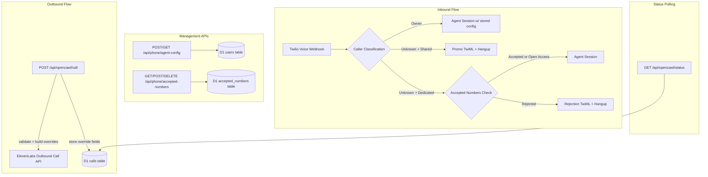
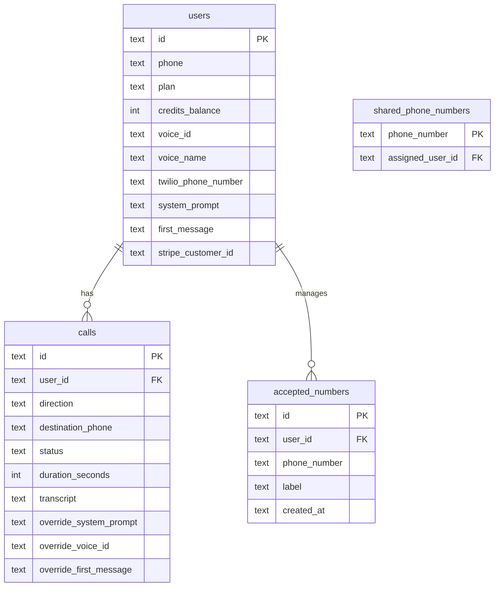

# Design Document: Per-Call Agent Configuration

## Overview

This feature extends the OpenCawl phone platform to support per-call agent configuration on outbound calls, smart inbound call routing based on caller identity and number type, accepted numbers list management for paid users, and user-level agent configuration storage. The design builds on the existing Cloudflare Pages Functions architecture with D1 (SQLite), ElevenLabs Conversational AI, and Twilio telephony.

The core changes are:
1. Modify the outbound call endpoint to accept and forward `system_prompt`, `voice_id`, and `first_message` via ElevenLabs' `conversation_config_override` API
2. Rewrite the inbound Twilio voice webhook to classify callers (owner vs unknown) and route accordingly (agent session, promo message, or accepted-numbers gate)
3. Add new `accepted_numbers` table and CRUD endpoints for paid users
4. Add agent config columns to the `users` table with GET/POST endpoints
5. Extend the `calls` table to store per-call override fields for status polling
6. Leave the tools webhook stub untouched

## Architecture



### Key Design Decisions

1. **`conversation_config_override` over `agent_overrides`**: The existing code uses `agent_overrides` for voice_id, but the ElevenLabs API's canonical structure for overrides is `conversation_config_override` nested inside `conversation_initiation_client_data`. We'll migrate to this structure for system_prompt, voice_id, and first_message overrides. This requires enabling overrides in the ElevenLabs agent security settings.

2. **Inbound routing via TwiML Stream parameters**: For owner calls and accepted unknown calls on dedicated numbers, we pass override data as `<Parameter>` elements in the TwiML `<Stream>` tag, which ElevenLabs reads as `conversation_initiation_client_data`. For the WebSocket-based inbound flow, overrides are passed as query parameters or via the conversation initiation webhook.

3. **Accepted numbers as a separate table**: Rather than a JSON column on users, a dedicated `accepted_numbers` table allows indexed lookups during inbound call routing and straightforward CRUD operations.

4. **Override fields stored on calls table**: Storing `system_prompt`, `voice_id`, `first_message` on the call record enables the status endpoint to return what overrides were used, without re-querying the user's config.

## Components and Interfaces

### Modified Endpoints

#### `POST /api/opencawl/call` (Outbound Call)

Updated request body:
```json
{
  "destination_phone": "+14155551234",
  "message": "Optional legacy message",
  "system_prompt": "You are a friendly assistant...",
  "voice_id": "voice-abc123",
  "first_message": "Hello! How can I help you today?"
}
```

- `destination_phone` remains required
- `message` becomes optional when `system_prompt` + `first_message` are provided
- `system_prompt` max 10,000 chars, `first_message` max 2,000 chars
- Builds `conversation_initiation_client_data.conversation_config_override` for ElevenLabs:
  ```json
  {
    "agent_id": "...",
    "agent_phone_number_id": "...",
    "to_phone_number": "...",
    "conversation_initiation_client_data": {
      "conversation_config_override": {
        "agent": {
          "prompt": { "prompt": "<system_prompt>" },
          "first_message": "<first_message>"
        },
        "tts": {
          "voice_id": "<voice_id>"
        }
      },
      "dynamic_variables": {
        "user_id": "...",
        "call_id": "...",
        "message": "..."
      }
    }
  }
  ```
- Stores override fields on the call record in D1

#### `POST /api/webhooks/twilio/voice` (Inbound Router)

Rewritten routing logic:

1. Parse form body, validate Twilio signature (unchanged)
2. Determine number type: query `shared_phone_numbers` table — if found, it's a shared number; otherwise, it's a dedicated number
3. Look up owner: query `users` by `twilio_phone_number = calledNumber`
4. Classify caller:
   - If `callerNumber == owner.phone` → **Owner Call**
   - If shared number + not owner → **Unknown on Shared**
   - If dedicated number + not owner → **Unknown on Dedicated**
5. Route:
   - **Owner Call**: Create call record, build TwiML Stream with owner's agent config overrides (system_prompt, voice_id, first_message from users table)
   - **Unknown on Shared**: Return promo TwiML `<Say>` + `<Hangup/>`
   - **Unknown on Dedicated**: Check `accepted_numbers` table. If list is empty (open access) or caller is in list → accept, create call record, query call history, build TwiML Stream with history context. If list is non-empty and caller not in it → rejection TwiML + hangup.

#### `GET /api/opencawl/status` (Call Status)

Updated response:
```json
{
  "call_id": "uuid",
  "status": "completed",
  "duration_seconds": 45,
  "transcript": "...",
  "agent_override": {
    "system_prompt": "...",
    "voice_id": "...",
    "first_message": "..."
  }
}
```

`agent_override` is `null` when no overrides were used. Fields within are `null` when not provided.

### New Endpoints

#### `POST /api/phone/agent-config`

Saves default agent configuration for the authenticated user.

```json
// Request
{ "system_prompt": "...", "voice_id": "...", "first_message": "..." }
// Response
{ "success": true }
```

- Partial updates: only provided fields are overwritten
- Validation: `system_prompt` ≤ 10,000 chars, `first_message` ≤ 2,000 chars

#### `GET /api/phone/agent-config`

Returns the user's stored agent configuration.

```json
{
  "system_prompt": "...",
  "voice_id": "...",
  "first_message": "..."
}
```

#### `GET /api/phone/accepted-numbers`

Returns the user's accepted numbers list. Requires paid plan.

```json
{
  "numbers": [
    { "phone_number": "+14155551234", "label": "Mom", "created_at": "..." }
  ]
}
```

#### `POST /api/phone/accepted-numbers`

Adds numbers to the accepted list. Requires paid plan.

```json
// Request
{
  "numbers": [
    { "phone_number": "+14155551234", "label": "Mom" }
  ]
}
// Response
{ "success": true, "added": 1 }
```

- Each `phone_number` must be valid E.164
- `label` is optional

#### `DELETE /api/phone/accepted-numbers`

Removes numbers from the accepted list. Requires paid plan.

```json
// Request
{ "phone_numbers": ["+14155551234"] }
// Response
{ "success": true, "removed": 1 }
```

### Unchanged Endpoints

#### `POST /api/webhooks/elevenlabs/tools`

Remains a 501 stub per Requirement 8.

## Data Models

### Migration: Add agent config columns to `users`

```sql
ALTER TABLE users ADD COLUMN system_prompt TEXT;
ALTER TABLE users ADD COLUMN first_message TEXT;
```

Note: `voice_id` and `voice_name` already exist on the users table.

### Migration: Add override columns to `calls`

```sql
ALTER TABLE calls ADD COLUMN override_system_prompt TEXT;
ALTER TABLE calls ADD COLUMN override_voice_id TEXT;
ALTER TABLE calls ADD COLUMN override_first_message TEXT;
```

### Migration: Create `accepted_numbers` table

```sql
CREATE TABLE IF NOT EXISTS accepted_numbers (
  id TEXT PRIMARY KEY,
  user_id TEXT NOT NULL REFERENCES users(id),
  phone_number TEXT NOT NULL,
  label TEXT,
  created_at TEXT NOT NULL,
  UNIQUE(user_id, phone_number)
);

CREATE INDEX idx_accepted_numbers_user_id ON accepted_numbers(user_id);
CREATE INDEX idx_accepted_numbers_lookup ON accepted_numbers(user_id, phone_number);
```

### Entity Relationships




## Correctness Properties

*A property is a characteristic or behavior that should hold true across all valid executions of a system — essentially, a formal statement about what the system should do. Properties serve as the bridge between human-readable specifications and machine-verifiable correctness guarantees.*

### Property 1: Outbound override payload construction

*For any* combination of optional override fields (`system_prompt`, `voice_id`, `first_message`) provided to the outbound call endpoint, the constructed ElevenLabs payload SHALL map each provided field to its correct nested path: `system_prompt` → `conversation_config_override.agent.prompt.prompt`, `voice_id` → `conversation_config_override.tts.voice_id`, `first_message` → `conversation_config_override.agent.first_message`. Omitted fields SHALL NOT appear in the override object.

**Validates: Requirements 1.1, 1.2, 1.3**

### Property 2: Override field length validation

*For any* string exceeding the maximum allowed length for its field (`system_prompt` > 10,000 chars, `first_message` > 2,000 chars), both the outbound call endpoint and the agent config endpoint SHALL reject the request with a 400 status and code `INVALID_INPUT`. *For any* string within the allowed length, the request SHALL NOT be rejected on length grounds.

**Validates: Requirements 1.5, 1.6, 6.3, 6.4**

### Property 3: Inbound caller classification

*For any* inbound call where the caller's phone number matches the `phone` field of the user who owns the called Twilio number, the inbound router SHALL classify the call as an Owner_Call. *For any* inbound call where the caller's phone number does not match, the call SHALL be classified as an Unknown_Caller.

**Validates: Requirements 2.1**

### Property 4: Owner call uses stored agent config

*For any* Owner_Call where the owner has a stored agent configuration (system_prompt, voice_id, first_message), the inbound router SHALL include those values in the ElevenLabs session parameters passed via the TwiML Stream.

**Validates: Requirements 2.2**

### Property 5: Inbound call record creation

*For any* accepted inbound call (owner calls, accepted unknown callers on dedicated numbers), the inbound router SHALL create a call record in the calls table with `direction = 'inbound'` and `destination_phone` set to the caller's phone number.

**Validates: Requirements 2.4, 4.5**

### Property 6: Unknown caller on shared number gets promo and hangup

*For any* unknown caller on a shared number, the inbound router SHALL return TwiML containing a `<Say>` element with the promo message and a `<Hangup/>` element, and SHALL NOT contain a `<Connect>` or `<Stream>` element.

**Validates: Requirements 3.1, 3.3**

### Property 7: Accepted numbers gate on dedicated numbers

*For any* unknown caller on a dedicated number where the owner has a non-empty accepted numbers list, the call SHALL be accepted (connected to agent) if and only if the caller's phone number is in the accepted numbers list. If the caller is not in the list, the response SHALL be a rejection TwiML with hangup.

**Validates: Requirements 4.1, 4.2**

### Property 8: Accepted numbers CRUD round-trip

*For any* set of valid E.164 phone numbers with optional labels added via the POST endpoint, the GET endpoint SHALL return all added numbers with their labels and creation timestamps. After removing a subset via DELETE, the GET endpoint SHALL return only the remaining numbers.

**Validates: Requirements 5.1, 5.2, 5.3**

### Property 9: E.164 validation on accepted numbers

*For any* phone number string that does not conform to E.164 format, the accepted numbers POST endpoint SHALL reject it with a 400 error and code `INVALID_INPUT`.

**Validates: Requirements 5.4**

### Property 10: Agent config round-trip with partial updates

*For any* valid agent configuration saved via POST, the GET endpoint SHALL return the same values. *For any* subsequent partial update (a subset of fields), only the provided fields SHALL be overwritten and omitted fields SHALL retain their previous values.

**Validates: Requirements 6.1, 6.2, 6.5**

### Property 11: Call status returns stored overrides

*For any* call initiated with override fields (system_prompt, voice_id, first_message), the status endpoint SHALL return those same override values in the `agent_override` response object.

**Validates: Requirements 7.2**

### Property 12: Call history context for accepted callers

*For any* accepted unknown caller on a dedicated number, the inbound router SHALL query previous calls from that caller to the same user and pass the call count as a dynamic variable to the ElevenLabs agent session.

**Validates: Requirements 4.4**

## Error Handling

| Scenario | HTTP Status | Error Code | Message |
|---|---|---|---|
| `system_prompt` > 10,000 chars | 400 | INVALID_INPUT | system_prompt exceeds maximum length of 10,000 characters |
| `first_message` > 2,000 chars | 400 | INVALID_INPUT | first_message exceeds maximum length of 2,000 characters |
| Missing `destination_phone` on outbound | 400 | INVALID_INPUT | Missing required fields: destination_phone |
| Invalid E.164 in accepted numbers | 400 | INVALID_INPUT | One or more phone numbers are not valid E.164 format |
| Free user accessing accepted numbers | 403 | FORBIDDEN | This feature requires a paid plan |
| Call not found or wrong user | 404 | NOT_FOUND | Call not found |
| Unknown called number (no user) | TwiML | — | "Sorry, this number is not configured." |
| Unknown caller rejected on dedicated | TwiML | — | "This number is not currently accepting calls." |
| Unknown caller on shared number | TwiML | — | Promo message about OpenCawl |
| ElevenLabs API failure on outbound | 500 | INTERNAL_ERROR | Failed to initiate outbound call |
| D1 database error | 500 | INTERNAL_ERROR | Context-specific message |
| Tools webhook called | 501 | NOT_IMPLEMENTED | Tool webhooks are not yet configured |

All error responses follow the existing `{ error: { code, message } }` JSON envelope pattern. TwiML error responses use `<Say>` elements for caller-facing messages.

## Testing Strategy

### Property-Based Tests (fast-check)

The project will use [fast-check](https://github.com/dubzzz/fast-check) for property-based testing. Each property test runs a minimum of 100 iterations.

Property tests target pure logic extracted into testable functions:

- **Payload builder function**: Extracted from `call.js` — takes override fields and user data, returns the ElevenLabs API payload. Tests Properties 1, 2.
- **Caller classifier function**: Extracted from `voice.js` — takes caller number, owner record, shared number lookup result, returns classification enum. Tests Property 3.
- **Inbound route builder function**: Extracted from `voice.js` — takes classification, owner config, accepted numbers list, call history, returns TwiML string or route decision. Tests Properties 4, 5, 6, 7, 12.
- **Accepted numbers validation**: Tests Property 9 using the existing `isValidE164` function.
- **Agent config merge function**: Extracted logic for partial updates. Tests Property 10.

Each property test is tagged with: `Feature: per-call-agent-config, Property {N}: {title}`

### Unit Tests (example-based)

- Default behavior when no overrides provided (Req 1.4)
- `destination_phone` still required (Req 1.7)
- `message` optional when system_prompt + first_message present (Req 1.8)
- Owner call fallback when no agent config stored (Req 2.3)
- Open-access mode when accepted list is empty (Req 4.3)
- Free user gets 403 on accepted numbers endpoints (Req 5.5)
- Status endpoint returns existing fields (Req 7.1)
- In-progress call returns null duration/transcript (Req 7.3)
- Call ownership check on status endpoint (Req 7.4)
- Promo message content references OpenCawl (Req 3.2)
- Tools webhook returns 501 (Req 8.1, 8.2)

### Integration Tests

- Full outbound call flow with mocked ElevenLabs API
- Full inbound call flow for each routing path with mocked D1
- Accepted numbers CRUD lifecycle
- Agent config save/retrieve lifecycle
