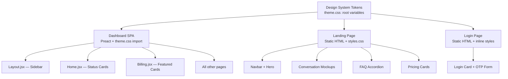

# Design Document: UI Design Overhaul

## Overview

This design replaces the generic indigo/purple aesthetic across all three platform surfaces (landing page, login page, dashboard SPA) with a warm, editorial design language built on a coral accent (#E8655A), deep dark palette (#0d0d0d), and gold featured highlights (#D4A843).

The approach centers on a single shared CSS custom properties file (`src/dashboard/styles/theme.css`) that serves as the design system source of truth. The landing page and login page — which are static HTML — will adopt these tokens either by importing the shared file or by redefining the same `:root` variables in their own stylesheets to match. The dashboard already imports `theme.css` via Vite, so it inherits tokens automatically.

Key changes:
- **Color system**: Coral replaces indigo/purple everywhere. Gradients are removed. Gold border token added for featured cards.
- **Landing page**: Restructured with editorial layout, conversation mockups, FAQ accordion, coral CTAs with pill shape, and updated navbar/footer.
- **Login page**: Coral accent, pill buttons, matching dark palette.
- **Dashboard**: Spacious padding, status card grid on home page, coral sidebar indicators, gold-bordered featured billing cards.
- **Typography/spacing**: Formalized type scale and spacing scale as CSS custom properties.
- **Meta tags**: OG tags, favicon, theme-color added to all three HTML entry points.

All changes are purely frontend — no backend or API modifications required.

## Architecture

The overhaul follows a layered architecture:



**Token flow**: The dashboard imports `theme.css` directly via its Vite build. The landing page's `styles.css` and the login page's inline `<style>` block both redefine the same `:root` custom properties to ensure consistency. This avoids cross-build import complexity while maintaining a single logical design system.

## Components and Interfaces

### Design System Tokens (theme.css :root)

The existing `:root` block in `theme.css` will be replaced with the new token set:

| Token Category | Property | Value |
|---|---|---|
| **Backgrounds** | `--bg` | `#0d0d0d` |
| | `--bg-card` | `rgba(255,255,255,0.04)` |
| | `--bg-card-hover` | `rgba(255,255,255,0.07)` |
| | `--bg-sidebar` | `#111111` |
| | `--bg-elevated` | `#1a1a1a` |
| **Text** | `--text` | `#F5F5F5` |
| | `--text-muted` | `#8A8A8A` |
| | `--text-hover` | `#FFFFFF` |
| **Accent** | `--accent` | `#E8655A` |
| | `--accent-hover` | `#d4574c` |
| **Borders** | `--border` | `#1e1e2e` |
| | `--border-gold` | `#D4A843` |
| **Status** | `--success` | `#34D399` |
| | `--error` | `#F87171` |
| | `--warning` | `#FBBF24` |
| **Radii** | `--radius` | `12px` |
| | `--radius-sm` | `8px` |
| | `--radius-pill` | `999px` |
| **Type Scale** | `--text-xs` | `0.75rem` |
| | `--text-sm` | `0.85rem` |
| | `--text-base` | `1rem` |
| | `--text-lg` | `1.15rem` |
| | `--text-xl` | `1.5rem` |
| | `--text-2xl` | `2rem` |
| | `--text-3xl` | `3rem` |
| **Spacing** | `--space-1` through `--space-10` | `4px` through `64px` |
| **Transitions** | `--transition-fast` | `150ms ease` |
| | `--transition-base` | `200ms ease` |
| | `--transition-slow` | `250ms ease` |
| **Layout** | `--sidebar-width` | `240px` |
| | `--max-width` | `1120px` |

### Removed Tokens

- `--gradient` — removed entirely (no more gradient backgrounds or gradient text)
- `--accent-light` — replaced by `--accent` (coral) for all accent uses
- `--bg-card-hover` previous hex value replaced with semi-transparent white

### Light Theme Variant

The `[data-theme="light"]` block will be updated to use coral accent instead of indigo, with appropriate light-mode background/text inversions. The light theme keeps the same `--accent: #E8655A` and `--border-gold: #D4A843`.

### Component Changes

#### 1. Sidebar (Layout.jsx + theme.css)

- `.sidebar-logo`: Change from `background: var(--gradient)` + clip to solid `color: var(--accent)`
- `.sidebar` background: Use `var(--bg-sidebar)` (now `#111111`)
- `.sidebar-nav a.active`: Change `color` to `var(--accent)`, `border-left-color` to `var(--accent)`
- `.sidebar-nav a`: Hover transition uses `--transition-base`

No JSX structure changes needed — only CSS updates.

#### 2. Dashboard Home — Status Cards (Home.jsx + theme.css)

Current home page has a 2-column grid with CreditCard + action buttons. This will be replaced with a 4-card status grid:

```jsx
// New status card grid in Home.jsx
<div class="status-grid">
  <div class="status-card">
    <div class="status-card-icon">💰</div>
    <div class="status-card-value" style={{ color: creditColor }}>{balance}</div>
    <div class="status-card-label">Credit Balance</div>
  </div>
  <div class="status-card">
    <div class="status-card-icon">📞</div>
    <div class="status-card-value">{phoneNumber || 'None'}</div>
    <div class="status-card-label">Phone Number</div>
  </div>
  <div class="status-card">
    <div class="status-card-icon">🎙️</div>
    <div class="status-card-value">{voiceName || 'Default'}</div>
    <div class="status-card-label">Active Voice</div>
  </div>
  <div class="status-card">
    <div class="status-card-icon">📊</div>
    <div class="status-card-value">{dailyCalls}</div>
    <div class="status-card-label">Calls Today</div>
  </div>
</div>
```

CSS for `.status-grid`: 4-column responsive grid (`repeat(auto-fit, minmax(200px, 1fr))`), stacking to 1 column at 768px.

`.status-card` styling: `background: var(--bg-card)`, `border: 1px solid var(--border)`, `border-radius: var(--radius)`, `padding: 24px`, `text-align: center`.

#### 3. Dashboard Layout — Spacing (theme.css)

- `.main-content` padding: `40px` on desktop, `24px 24px` on mobile (≤768px)
- `.page-title`: `font-size: 1.75rem`, `margin-bottom: 32px`
- Card padding: `24px`, card gap: `20px`

#### 4. Billing — Featured Card (Billing.jsx + theme.css)

The `PLANS` array gets a `featured` flag on the Starter plan. The featured card gets gold border treatment:

```css
.plan-card-featured {
  border-color: var(--border-gold);
  box-shadow: 0 0 24px rgba(212, 168, 67, 0.12);
}
```

Non-featured cards keep standard `var(--border)` border. The existing `.plan-card-current` class changes from `border-color: var(--accent)` to `border-color: var(--accent)` (still coral, just updated token).

`.plan-price` removes gradient text and uses solid `color: var(--text)`.

#### 5. Landing Page (index.html + styles.css)

Major restructure:

**Navbar**: Logo left, right side has "FAQ" link, "Log In" link, and a coral "Get Started" pill button.

**Hero**: White text on dark background. No gradient text. CTA is a coral pill button (`border-radius: var(--radius-pill)`).

**Conversation Mockup Sections**: Two alternating sections with text on one side and a stylized phone conversation UI on the other. These are pure HTML/CSS mockups showing chat bubbles in a phone frame.

```html
<section class="demo-section">
  <div class="demo-inner">
    <div class="demo-text">
      <h2>Your Claw, on the phone</h2>
      <p>The platform connects your AI agent to real phone numbers...</p>
    </div>
    <div class="demo-mockup">
      <div class="phone-frame">
        <div class="chat-bubble chat-incoming">Hello, this is your assistant...</div>
        <div class="chat-bubble chat-outgoing">I'd like to schedule...</div>
      </div>
    </div>
  </div>
</section>
```

Second section reverses the layout (mockup left, text right).

**FAQ Accordion**: Replaces the old waitlist section position. Each item is a `<details>` element with a `<summary>` for the question and content for the answer. Styled with smooth height transition.

```html
<section class="faq" id="faq">
  <div class="section-inner">
    <h2 class="section-title">Frequently Asked Questions</h2>
    <div class="faq-list">
      <details class="faq-item">
        <summary class="faq-question">What is this platform?</summary>
        <div class="faq-answer"><p>This platform gives your AI agents...</p></div>
      </details>
      <!-- more items -->
    </div>
  </div>
</section>
```

**Pricing Cards**: Featured card uses `--border-gold` border and gold glow shadow, matching dashboard featured card treatment.

**Footer**: Updated to "© 2026 OpenCawl", GitHub link, Docs link, and tagline.

**Feature Cards**: Dark card backgrounds with `border-color` transitioning to `var(--accent)` on hover (replacing gradient hover).

#### 6. Login Page (index.html inline styles)

- `:root` variables updated to match design system tokens
- `.login-logo`: solid `color: var(--accent)` instead of gradient
- `.btn-primary`: solid `background: var(--accent)`, `border-radius: 999px`
- `.form-input:focus`: `border-color: var(--accent)`
- Background: `var(--bg)` = `#0d0d0d`

#### 7. Meta Tags (all three HTML files)

Each HTML file gets these additions in `<head>`:

```html
<meta property="og:title" content="OpenCawl - [page-specific description]" />
<meta property="og:image" content="https://images.opencawl.ai/logo/opencawl-logo.png" />
<meta property="og:type" content="website" />
<meta name="twitter:card" content="summary_large_image" />
<meta name="theme-color" content="#0d0d0d" />
<link rel="icon" href="https://images.opencawl.ai/logo/opencawl-logo.png" />
```

Page-specific OG titles:
- Landing: `"OpenCawl - Give your agent a phone number"`
- Login: `"OpenCawl - Log in to your account"`
- Dashboard: `"OpenCawl - Dashboard"`

## Data Models

No data model changes are required. This overhaul is purely presentational — all API endpoints, database schema, and state management remain unchanged.

The only "data" consideration is the `PLANS` array in `Billing.jsx`, which gains a `featured: true` property on the Starter plan to drive gold border rendering:

```js
const PLANS = [
  { name: 'free', label: 'Free', price: '$0', credits: '250 one-time', featured: false, features: [...] },
  { name: 'starter', label: 'Starter', price: '$20/mo', credits: '1,200/mo', featured: true, features: [...] },
  { name: 'pro', label: 'Pro', price: '$50/mo', credits: '4,200/mo', featured: false, features: [...] },
];
```

## Error Handling

No new error handling is required. This is a visual-only change. Existing error handling for API calls, form validation, and network errors remains untouched.

The FAQ accordion uses native `<details>/<summary>` elements which degrade gracefully in all modern browsers. No JavaScript error handling needed for the accordion.

The conversation mockup sections are static HTML — no dynamic data fetching or error states.

## Testing Strategy

### Why Property-Based Testing Does Not Apply

This feature is entirely about UI rendering, CSS theming, HTML meta tags, and visual component styling. There are no pure functions with meaningful input/output behavior, no data transformations, no parsers or serializers. The requirements describe:

- CSS custom property values (configuration)
- HTML markup structure changes
- Visual hover/transition behaviors
- Border colors and box shadows
- Typography and spacing values

None of these produce universally quantifiable properties. "For all inputs X, property P(X) holds" statements cannot be meaningfully written for CSS variable definitions or HTML meta tag presence.

### Recommended Testing Approach

**Manual visual review**: The primary validation method. Each requirement maps to visible changes that should be reviewed in-browser across the three surfaces.

**Snapshot/screenshot testing** (optional, if CI tooling supports it): Capture rendered pages and compare against baselines to detect unintended regressions.

**Example-based unit tests** for specific verifiable facts:
- Test that `PLANS` array in `Billing.jsx` includes `featured: true` on the correct plan
- Test that the landing page `script.js` phone validation function still works after refactoring

**Checklist-based acceptance testing**: Each requirement's acceptance criteria maps to a visual/structural check:

| Requirement | Verification Method |
|---|---|
| 1. Design System | Inspect `:root` variables in theme.css; verify no indigo/purple hex values remain |
| 2. Landing Page | Visual review of navbar, hero, mockups, FAQ, footer, feature cards |
| 3. Meta Tags | Inspect `<head>` of all three HTML files for OG/favicon/theme-color tags |
| 4. Dashboard Layout | Measure padding, font sizes, card spacing in browser dev tools |
| 5. Sidebar | Visual review of logo color, active indicator, hover transitions |
| 6. Login Page | Visual review of button shape, accent colors, input focus states |
| 7. Typography/Spacing | Verify type scale and spacing tokens exist in `:root`; grep for ad-hoc values |
| 8. Interactive Components | Test hover states, accordion animation, card transitions in browser |
| 9. Featured Cards | Verify gold border on featured billing card and featured pricing card |

### File Change Summary

| File | Change Type | Requirements Addressed |
|---|---|---|
| `src/dashboard/styles/theme.css` | Major update — new tokens, spacing, card styles, sidebar styles, status grid, featured card styles | 1, 4, 5, 6, 7, 8, 9 |
| `src/landing/index.html` | Major restructure — navbar, hero, mockup sections, FAQ, footer, meta tags | 2, 3 |
| `src/landing/styles.css` | Major update — new tokens, pill buttons, mockup styles, FAQ accordion, editorial layout | 1, 2, 7, 8, 9 |
| `src/landing/script.js` | Minor update — FAQ accordion behavior (if not using native `<details>`) | 8 |
| `src/login/index.html` | Moderate update — inline style tokens, button shape, logo color, meta tags | 3, 6 |
| `src/dashboard/index.html` | Minor update — meta tags, favicon | 3 |
| `src/dashboard/components/Layout.jsx` | No JSX changes needed — CSS handles sidebar styling | 5 |
| `src/dashboard/pages/Home.jsx` | Moderate update — replace 2-col layout with 4-card status grid | 4 |
| `src/dashboard/pages/Billing.jsx` | Minor update — add `featured` flag to PLANS, apply featured class | 9 |
| `src/dashboard/components/CreditCard.jsx` | Minor update — may be simplified since status grid replaces standalone card | 4 |
